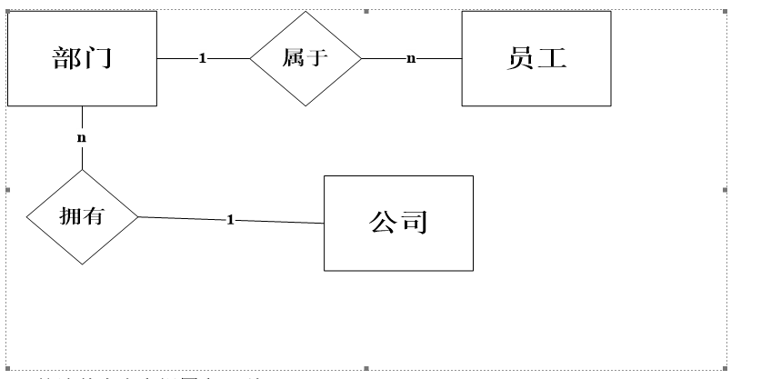
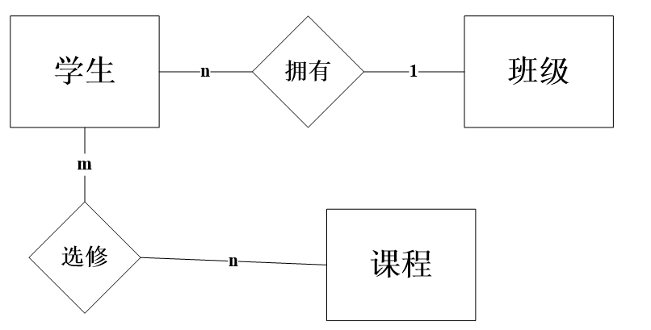

# min.github.io
<!DOCTYPE html>
<html lang="en">

<head>
    <meta charset="UTF-8">
    <meta name="viewport" content="width=device-width, initial-scale=1.0">
    <title>Document</title>
</head>

<body>
    <h1>数据库应用SQL Server复习题（答案）</h1>

    <h2>一、选择题</h2>

    
1．使用SQL动词命令无法实现（ D ）。

    
A．数据操纵 B.数据控制

    
C．数据查询 D.数据计算　

    
2．以下数据类型中，不是整数类型的是( C ) 。

    
A. int B.smallint

    
C.binary D.bit

    
3.以下函数中，用于计算平均值的是 ( A ) 。

    
A.AVG() B.MIN()

    
C.SUM() D.MAX()

    
4.执行ABS(-10.5)的输出结果是( C ) 。

    
A.-10.5 B.-10

    
C.10.5 D.10

    
5.在SQL的下列语句中，能够实现参照完整性约束的语句（D ）。

    
A.FOREIGN KEY B.PRIMARY KEY

    
C.REFERENCES D.FOREIGN KEY和REFERENCES

    
6、公司中有多个部门和多名职员，每个职员只能属于一个部门，一个部门可以有多名职员，从职员到部门的联系类型是(C )。

    
A、多对多 B、一对一 C、多对一 D、一对多

    
7、 关系数据库中空值（NULL）相当于(D )。

    
A、零（0） B、 空白 C、 零长度的字符串 D、 没有输入

    
8、事务有多个性质，其中不包括(B )。

    
A、隔离性 B、 不可撤消 C、原子性 D、 一致性

    
9、 下列四项中，不属于数据库特点的是(C )。

    
A、数据共享 B、数据完整性

    
C、数据冗余很高 D、数据独立性高

    
10、在数据库系统中，日志文件用于（D ）。

    
A、保障事务的并发性 B、保障数据的安全性

    
C、检测系统的死锁 D、数据库故障的恢复

    
11、下列哪一个数据库不是SQL Server 2005的系统数据库（ C ）。

    
A、master数据库 B、msdb数据库

    
C、pubs数据库 D、model数据库　

    
12、 在SQL中，SELECT语句的"SELECT DISTINCT"表示查询结果中 (C ) 。

    
A、属性名都不相同 B、去掉了重复的列

    
C、行都不相同 D、属性值都不相同

    
13、在数据操作语言(DML)的基本功能中，不包括的是 (B ) 。

    
A、插入新数据 B、描述数据库结构

    
C、修改数据 D、删除数据

    
14、在采用客户机/服务器体系结构的数据库应用系统中，应该将用户应用程序安装在 (A ) 。

    
A、客户机端 B、服务器端

    
C、终端 D、系统端

    
15、在SQL的下列语句中，能够实现参照完整性约束的语句（D ）。

    
A、FOREIGN KEY B、PRIMARY KEY

    
C、REFERENCES D、FOREIGN KEY和REFERENCES

    
16、 数据库系统的日志文件用于记录下述哪类内容（ D ）。

    
A、 程序运行过程 B、 数据查询操作

    
C、 程序执行结果 D、数据更新操作

    
17、对系统存储过程的说法正确的是（ B ）。

    
A、 SQL Server系统自带的（以sp_开头），所有的用户都可直接调用系统存储过程

    
B、 当新建一个数据库时，一些系统存储过程会在新建的数据库中自动创建

    
C、 sp_helptext用于报告有关数据库对象（sysobjects 表中列出的任何对象）、用户定义数据类型或SQL Server所提供的数据类型的信息

    
D、 sp_help用于显示规则、默认值、未加密的存储过程、用户定义函数、触发器或视图的文本

    
18．以下数据库中，不是系统数据库的是( B )。

    
A．master B.polybase C.msdb D.tempdb

    
19. 以下约束类型中表示主码的是（ B )。

    
A.CHECK B. PRIMARY KEY C.DEFAULT D. FOREIGN KEY

    
20.创建数据库时，T-SQL语句中不可以省略的是( A )。

    
A.数据库名称 B. 数据库文件地址 C.最大容量 D. 日志文件名称

    
21. 使用ALTER TABLE命令不能( A )。

    
A.缩减数据结构的字节长度 B.删除某一约束

    
C.加宽数据结构的字节长度 D.增加新字段

    
22.在数据库系统中，日志文件用于（ D ）。

    
A.保障事务的并发性 B.保障数据的安全性

    
C.检测系统的死锁 D.数据库故障的恢复

    <h2>二、填空题</h2>

    
1、SQL Server 2019四个系统数据库是master、model、tempdb和msdb。
    

    
2、数据库的三个发展阶段是人工管理、文件系统和数据库系统。
    

    
3、使用filegrowth命令可以增加数据库和事务日志的容量。

    
4、关系模式的三类完整性约束条件分别是体完整性约束、参照完整性约束和域完整性约束。

    
5、如果一个关系不满足2NF，则该关系一定也不满足3nf(在1NF、2NF、3NF范围内)。

    
6、数据库中，主数据库文件和日志数据文件的扩展名分别是.mdf和.ldf。

    
7、局部变量的开头字符是@，全局变量的开头字符是@@。

    
8、当在一个已经存放了数据的表上增加主键时，SQL Server会自动对表中的数据进行检查，以确保这些数据能够满足主键约束的要求。满足主键值唯一和不允许为空（或not
            null）两个要求。

    
9、数据定义语言是指用来创建、修改和删除各种对象的语句是create、alter和drop。
    

    
10、数据操纵语言是指用来查询、添加、修改和删除数据库中数据的语句，这些语句包括select、insert、update和delete。

    
11、实体型学生与任课教师之间具有多对多联系。

    
12、设有关系B（书号，书名），如果要检索第3个字母为N，且至少包含4个字母的书名，则SQL查询语句中WHERE子句的条件表达式应写成：书名 Like '_ _N _ %'。

    
13、反映现实世界中实体及实体间联系的信息模型是E-R图。

    
14、数据库系统中常用的三种数据模型有层次模型、网状模型和关系模型。
    

    
15、select语句查询条件中的谓词"=any"与运算符in等价

    
16、数据库设计主要包括需求分析、概念设计、逻辑设计、物理设计、运行维护等步骤。

    
17、嵌套子查询一般可分为两种，即返回单个值的子查询和返回一个值列表的子查询。

    
18、事务是指一个单元的工作，这些工作要么全做，要么全不做。作为一个逻辑单元，必须具备4个属性，即原子性、一致性、独立性和持久性。
    

    
19、对表列定义了PRIMARY KEY（或主键）约束和UNIQUE（或惟一）约束时，会在表中指定的列上自动创建惟一索引。

    
20、当表中某列存在默认值时，可以用DEFAULT关键字代替该列的值。

    
21、批处理就是一个或多个Transact-SQL语句的集合，从应用程序一次性发送到SQL Server并由SQL
        Server编译成一个可执行单元，此单元称为执行计划。

    
22、选择参数BREAK命令用在单层的WHILE循环中使SQL Server提前退出循环，并将控制权转移给循环之后的语句。
    

    
23、在使用数据库建模时，实体、属性和联系分别用矩形框、椭圆和菱形表示。

    
24、如果想改变查询结果集中记录的显示顺序，可通过ORDER BY子句来实现。

    
25、要通过Internet访问SQL Server 2005，应启动TCP/IP协议。

    
26.完整性约束包括实体完整性、域完整性、参照完整性和用户定义完整性。

    
27.在SQL Server 2005中，数据库对象包括表、视图、触发器、过程、列、索引、约束、规则、默认和用户自定义的数据类型等。

    
28.语句 select day('2004-4-6'), len('我们快放假了.') 的执行结果是：6和7。

    
29.语句 select round(13.4321,2), round(13.4567,3)的执行结果是：13.4300和13.4570。

    
30.数据库系统具有数据的外模式、模式和内模式三级模式结构。

    
31.SQL Server 2005局部变量名字必须以@开头，而全局变量名字必须以@@开头。

    <h2>三、判断题</h2>

    
1、UNION运算符是用于将两个或多个检索结果合并成一个结果。 （ √ ）

    
2、数据库管理系统管理并且控制数据资源的使用。 （ √ ）

    
3、SQL Server有数据导入功能但没有数据导出功能。 （ × ）

    
4、任何由二个属性组成的关系不可能是 3NF。 （ × ）

    
5、 数据冗余引起的问题主要是花费空间。 （ × ）

    
6、在关系运算中，进行自然联接运算的两个关系必须具有相同关键字。 （ × ）

    
7、在数据库系统中，DBMS包括DBS和DB。 （ × ）

    
8、 SQL的标准库函数COUNT，SUM等是不允许直接出现在查询语句中的。 （× ）

    
9、数据库管理系统是一个软件系统。 （ √ ）

    
10、数据库系统指软件为主，不包括数据库与用户。 （ × ）

    
11、数据库的实体完整性控制是指R中主键或者为空,或者唯一。 （ × ）

    
12、数据模型是现实世界数据特征的抽象。 （ × ）

    
13、在SQL的查询中，子查询中不能返回多个记录，否则会出错。 （ × ）

    
14、关系模式R为3NF,则R不存在部分依赖。 （ × ）

    
15、在数据库中，不应该存储任何冗余数据。 （ × ）

    
16、安装SQL Server时既可以选择默认的安装路径，也可以自定义安装路径。（ × ）

    
17、脚本是存储在文件中的一系列SQL语句，即一系列按顺序提交的批处理。 （ √ ）

    
18、在同一台计算机中只能安装一个SQL Server 2005实例。 （ × ）

    
19、游标的声明是使用declare关键字。 （ √ ）

    
20、当更新触发器表中的数据时， UPDATE触发器将触发执行，表中原有的记录存放到UPDATED表中，修改后的记录插入到INSERTED表中。 （ × ）

    
21、当在表中建立了索引后，查询时可在表中逐行扫描，提高查询的准确性。 （ × ）

    
22、游标主要用在结果集、存储过程、触发器和Transact-SQL脚本中，使用游标，可以对由SELECT语句所返回的结果集记录进行逐行处理。 （ × ）

    
23、左外联接的结果集中包括了左表的所有记录，右外联接的结果集中包括了右表的所有记录，而不仅仅是满足联接条件的记录。 （ √ ）

    
24、安装SQL Server时既可以选择默认的安装路径，也可以自定义安装路径。 （√ ）

    
25、结果集总是对当前行执行操作，游标则指示当前行的位置。 （ √ ）

    
26．自定义函数只能返回一个类型的值。 （ ╳ ）

    
27．分组查询中，聚合函数不能出现在select其后。 （ ╳ ）

    
28．SQL中，关键字可以只取其前四个字符。 （ √ ）

    
29．create function 必须出现在一个批的第一条语句。 （ √ ）

    
30．一个表可以创建多个聚集索引。 （ ╳ ）

    <h2>四、简答题</h2>

    
1、简述存储过程的特点。

    
答：①提高数据库的执行速度

    
②能实现模块化程序设计

    
③减少网络流量

    
④提高系统安全性

    
2、一个公司有多个部门，一个部门有多个员工，一个员工属于一个部门。请用E-R图画出 此公司的概念模型。

    
答：

    
3、简述基本表和视图和区别。

    
答：基本表是独立存在的表，它所对应的数据实际存储在数据库中；

    
视图是从一个表或多个基本表导出的表在数据库中存储有关视图的定义而不存放视图所对应的数据，视图是一个虚表。

    
4、数据库管理系统的主要功能有哪些？

    
答：①数据定义功能

    
②.数据操纵功能

    
③数据库的运行管理功能

    
④数据库的建立和维护功能

    
5、每个班有若干学生，每个学生选修若干课程，每门课可由若干学生选修。请用 E—R 图画出此学校的概念模型。

    
答：

    
6、写出约束的几种类型。

    
答：①主键（或primary key）约束

    
②唯一(或unique)约束

    
③检查（或check）约束

    
④默认（或default）约束

    
⑤外键（或foreign key）约束

    
7、流程控制语句主要有哪些？

    
答：①BEGIN…END语句块 ②IF…ELSE语句 ③CASE语句

    
④WAITFOR语句 ⑤WHILE语句

    
8、说出5个常用的系统函数，各个函数的基本作用是什么？

    
答：常用的系统函数有：字符串函数、数学函数、日期时间函数和数据类型转换函数等。

    

        其作用分别为：可以使用字符串函数对char、nchar、varchar、nvarchar、binary与varbinary等数据类型的数据进行各种不同的处理，并返回在字符数据操作中所需的数据值；数学函数用于对decimal、float、real、money与int等数据类型的数值表达式进行各种不同的运算并返回计算结果；日期时间函数可对datetime和small
        datetime数据类型的数据进行各种不同的处理和运算；数据类型转换函数将某种数据类型的表达式转换为另一种数据类型。

    
9、简述域完整性、实体完整性、参照完整性的概念。

    

        答：域完整性又称为列完整性，用以指定列的数据输入是否具有正确的数据类型、格式以及有效的数据范围，可以通过建立默认值约束、外键约束、检查约束、非空约束以及规则等措施来实现；实体完整性又称为行完整性。这里的实体是指表中的记录，一个实体就是表的一条记录。实体完整性要求在表中不能存在完全相同的记录，而且每条记录都要具有一个非空且不重复的主键值；参照完整性又称为引用完整性，是通过定义外键与主键之间或外键与惟一键之间的对应关系实现的。
    

    
10 .所有的视图是否都可以更新？为什么？

    
答：不是所有的视图都是可更新的；因为有些视图的更新不能唯一地有意义地转换成对相应基本表地更新

    
11. 数据库对象'默认'是什么，default约束与 '默认'的区别是什么？

    
答：默认用于在添加数据时没有明确给出某个值的情况，SQL Server会根据设置自动填入默认的值。

    
default约束，只能规定默认常量，默认对象与default约束相似，但默认对象的值可以是常量、内置函数或数学表达式。

    
12.什么是视图？视图的优点是什么？

    
答：

    
视图是一种数据库对象，它是由数据表或视图上的查询所定义的虚拟表。视图就是一条SELECT语句所对应的结果集，结果集的名字就是视图名。

    
视图的优点：

    
（1）简单化。视图可以只提取出用户需要的数据，便于管理和使用。

    
（2）安全性。数据库管理系统能够为不同的用户定制不同的视图，使他们只能查询和读写部分数据，未授权的数据既看不到也取不到。

    
（3）逻辑数据独立性。视图对应三级模式中的外模式（面向用户），当数据库的逻辑结构发生变化时，只需要修改视图的定义。

    <h2>五、操作题</h2>

    
1. 使用SQL Server Management Studio对象资源管理器方法，在已经建立的数据库scs的student表中设置sex(性别)列默认为"男",设置后将结果截图提交。

    
2. 使用SQL Server Management
        Studio对象资源管理器方法，应用已经建立的数据库scs，将主表student的sno(学号)列设为主键，将从表sgrade的sno(学号)列设为主表sno(学号)列的外键，将设置结果截图提交。

    
3.使用SQL Server Management
        Studio对象资源管理器方法，在已经建立的数据库Library的Readers表中，添加Readers表的默认值约束，要求"登记日期"列的默认值为系统当前日期，将设置结果截图提交。

    
4. 使用SQL Server Management Studio对象资源管理器(SSMS)方法，在已经建立的数据库scs的student表中设置dept(专业)列默认为"自动化",设置后将结果截图提交。

    <h2>六、编程题</h2>

    
1. 使用T-SQL语句，对数据库scs的表teacher,创建一个计算机系教师信息的视图v_t，其中包括tno(教师编号)、tn(教师姓名)及prof职称, 将运行结果截图上交。

    

        CREATE VIEW v_t  
        AS SELECT tno,tn,prof 
        &nbsp;&nbsp;FROM teacher 
        &nbsp;&nbsp;WHERE dept='计算机' 

    

    
2. 使用循环语句编程，求出 1+2+…+300的值，将运行结果截图上交。

    

        DECLARE @i int ,@s int 
        SET @i=1 
        SET @s=0 --定义两变量i,s 
        WHILE @i
        <=300 --当i的值大于100时，结束循环 
        BEGIN 
        SET @s=@s+@i 
        SET @i=@i+1 
        CONTINUE 
        END 
        PRINT '1+2+...+300的值是：'+CONVERT(varchar,@s)

    

    
3.计算books表中所有图书的平均价格、总价、最高价、最低价及记录的个数。

    

        SELECT 
        AVG(价格) AS 平均价格, 
        SUM(价格) AS 总价, 
        MAX(价格) AS 最高价, 
        MIN(价格) AS 最低价, 
        COUNT(*) AS 记录个数 
        FROM 
        Books; 
    

    
4.声明一个类型为real的局部变量，分别为其赋值为321.12 、87654321.456，求出其结果。

    

        DECLARE @x real 
        SET @x = 321.12 
        SELECT @x 
        SET @x = 87654321.456 
        SELECT @x 
    

    
5.编程序查询Books表中"通盛"出版社的编号、图书名、出版社、类编号及上架时间。查询结果先按类编号降序排列，类编号相同的书再按上架时间升序排列（数据库为Library）。

    

        USE Library 
        GO 
        SELECT 图书编号,图书名,出版社,类编号,上架时间 
        FROM Books 
        WHERE 出版社='通盛'  
        ORDER BY 类编号 DESC,上架时间 ASC 
        GO 
    

    
6.查询Books表中"图书名"相同作者不同的图书信息，只需要显示图书编号、图书名、作者和出版社即可。

    

        SELECT 
        图书编号, 
        图书名, 
        作者, 
        出版社, 
        FROM 
        Books b1 
        WHERE 
        EXISTS (  
        SELECT 1 
        FROM Books b2 
        WHERE b1.图书名 = b2.图书名 
        AND b1.作者 <> b2.作者 
            ); 
    

    
7.使用WHILE语句，求出1+2+……+100的值。

    

        DECLARE @i int,@s int 
        SET @i=1 
        SET @s=0 
        WHILE @i
        <=100 
        BEGIN 
        SET @s=@s+@i 
        SET @i=@i+1 
        CONTINUE 
        END 
        PRINT '1+2+...+100的值是：'+CONVERT(varchar,@s) 
    

    
8.使用T-SQL语句，应用数据库scs，从数据表teacher与teaching中查询教师编号为"01001"的教师所教授的课程，并列出其姓名和所教授课程的课程编号，将运行结果截图上交。

    

        SELECT teacher.tn,teaching.cno  
        FROM teacher INNER JOIN teaching 
        ON teacher.tno=teaching.tno  
        WHERE teacher.tno='01001' 
    

</body>

</html>
